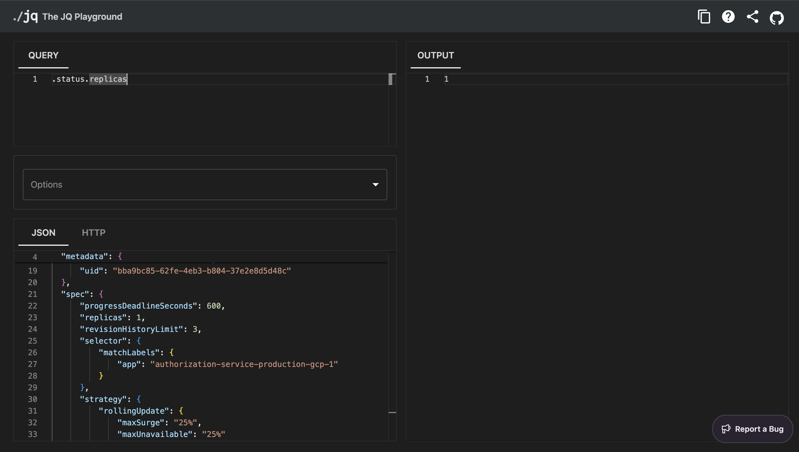
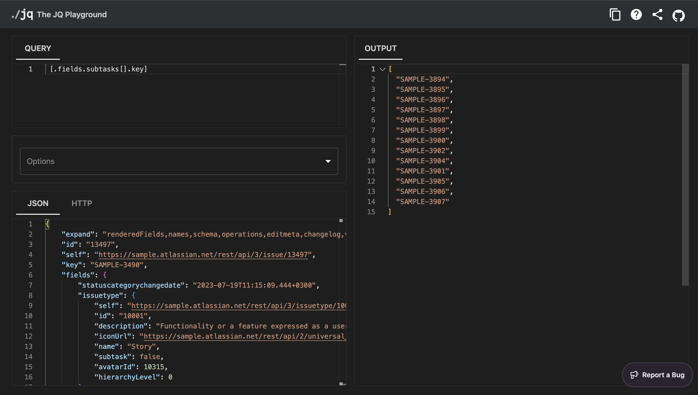
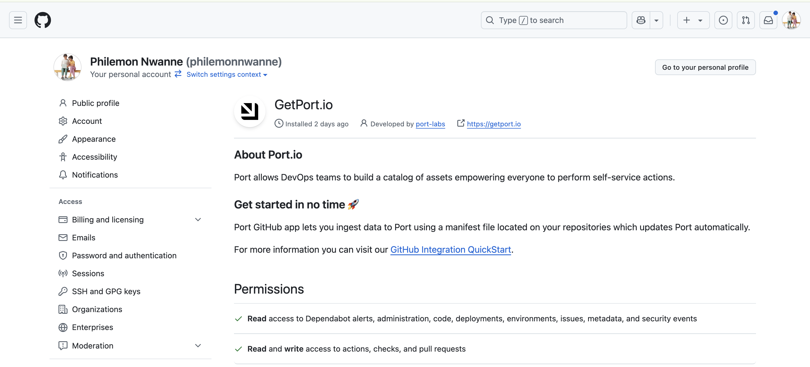

# Port Support Engineer Assignment Solution


## Overview

This document outlines my complete solution for the Port Support Engineer assignment. I've used real-world data from live integrations to demonstrate my practical skills with Port's platform. Each solution has been thoroughly tested and validated, with evidence provided.

## Repository Structure

```
port-dev/
├── README.md                    # This comprehensive documentation
├── configs/                     # All configuration files
│   ├── jira-integration.yaml
│   ├── scorecard-rules.json
│   ├── property-definition.json
│   └── github-workflow.yml
└── images/                      # All screenshots organized by exercise
    ├── exercise1/
    ├── exercise2/
    ├── exercise3/
    └── exercise4/
    └── extra/
```

---

## Exercise 1: JQ Patterns

### K8s Deployment Object Patterns

Using the provided Kubernetes deployment object, I developed the following JQ patterns.

#### 1.a Current Replica Count
**JQ Pattern:**
```bash
.status.replicas
```

**Explanation:** This is a simple path. You just go into the status section and grab the replicas number.

**Evidence:** 

#### 1.b Deployment Strategy
**JQ Pattern:**
```bash
.spec.strategy.type
```

**Explanation:** To find the deployment strategy, you navigate into the spec, then into strategy, and finally pull out the type field to see how it's set up, which is RollingUpdate in this case.

**Evidence:** 

#### 1.c Service and Environment Labels Concatenation
**JQ Pattern:**
```bash
.metadata.labels.service + "-" + .metadata.labels.environment
```

**Explanation:** This pattern grabs the service label, sticks a hyphen in the middle, and then adds the environment label right after it. It's just a way of putting those two values together into one string.

**Evidence:** 

### Jira API Subtasks Pattern

#### 2. Extract All Subtask Issue IDs
**JQ Pattern:**
```bash
[.fields.subtasks[].key]
```

**Explanation:**
- `.fields.subtasks`: This part finds the list of subtasks.
- `[]`: It then goes through each subtask, one at a time.
- `.key`: For each subtask, it pulls out the key, which is the ID.
- `[...]`: Finally, it collects all those IDs and puts them into a new array.

**Evidence:** 

---

## Exercise 2: Jira & GitHub Integration

### Implementation Overview

I successfully built a full integration pipeline that connects GitHub repositories to Jira components using Port's data model.

### GitHub App Installation

I installed the Port GitHub app and granted the necessary permissions for my account, including repository access and webhook management.

**Evidence:** 

### Jira Account Setup

Then I set up a new Jira account using a Company-managed Scrum project, which provides access to the required components feature.

**Evidence:** 

### Jira Ocean Integration Deployment

To meet the "No Hosted by Port" requirement, I deployed the Jira Ocean integration using a scheduled GitHub Actions workflow, that runs the Ocean integration container at a regular interval.

This gives me full control over the deployment and automates the data synchronization process. The workflow uses the official Port Ocean Jira integration Docker image and runs on GitHub's infrastructure, but I maintain full control over the configuration, scheduling, and management. For secure access, I configured all necessary credentials (Jira API token, Port credentials) as encrypted secrets in my GitHub repository.


**Configuration:** [View GitHub Workflow](.github/workflows/port-jira-exporter.yaml)

**Evidence:** 

### Data Model Configuration

In Port's Builder, I added a new relation from "Jira Issue" to "Repository." This link allows Port to connect issues to their respective GitHub repos via Jira components. This process is covered in the documentation on [relating blueprints](https://docs.port.io/build-your-software-catalog/customize-integrations/configure-data-model/relate-blueprints/).

**Evidence:** 

### Jira Components Setup

I created Jira components that mirrored my GitHub repository names to establish the connection:
- port-dev → port-dev
- port-test → port-test
- port-stage → port-stage

**Evidence:** 

### Integration Mapping

I updated the Jira Issues mapping to use the new relation:

```yaml
# Added mapping to connect components to repositories
- kind: issue
  selector:
    query: 'true'
    jql: (statusCategory != Done) OR (created >= -1w) OR (updated >= -1w)
  port:
    entity:
      mappings:
        identifier: .key
        title: .fields.summary
        blueprint: '"jiraIssue"'
        relations:
          repositories:
            combinator: '"or"'
            rules:
              - property: '"$identifier"'
                operator: '"in"'
                value: '[.fields.components[] | .name]'
```

This approach for [mapping relations](https://docs.port.io/build-your-software-catalog/customize-integrations/configure-mapping/) assumes Jira component names match the repository identifiers in Port.

**Complete Configuration:** [View Integration Config](config/mappings/jiraissue-githubrepo-component-mapping.yaml)

**Evidence:**  shows Jira issues successfully linked to GitHub repositories.


## Exercise 3: Scorecard Implementation

### Property Creation

I created a new Open PRs count property on the GitHub Repository blueprint to track the number of open pull requests. This uses aggregation property to count PRs with a state equal to "open."

**Configuration:** [View Property Definition](config/blueprints/pr-aggregation-logic.json)

**Evidence:** 

### Scorecard Logic

I implemented a scorecard on the same GitHub Repository blueprint which leveraged the logic I defined initially in the PR count property, to specify thresholds to measure PR management health. I followed the implementation guide from [Scorecard usage](https://docs.port.io/promote-scorecards/).

**Scorecard Configuration:**
```json
[
  {
    "identifier": "open_prs_scorecard",
    "title": "Open PRs per Repository",
    "rules": [
      {
        "identifier": "open_prs_gold",
        "title": "Less than 5 open PRs",
        "level": "Gold",
        "query": {
          "combinator": "and",
          "conditions": [
            {
              "operator": "<",
              "property": "openPrsCount",
              "value": 5
            }
          ]
        }
      },
      {
        "identifier": "open_prs_silver",
        "title": "Less than 10 open PRs",
        "level": "Silver",
        "query": {
          "combinator": "and",
          "conditions": [
            {
              "operator": "<",
              "property": "openPrsCount",
              "value": 10
            }
          ]
        }
      },
      {
        "identifier": "open_prs_bronze",
        "title": "Less than 15 open PRs",
        "level": "Bronze",
        "query": {
          "combinator": "and",
          "conditions": [
            {
              "operator": "<",
              "property": "openPrsCount",
              "value": 15
            }
          ]
        }
      }
    ]
  }
]
```

**Complete Configuration:** [View Scorecard Rules](config/blueprints/score-card-logic.json)

**Evidence:** 


### Testing Results

The scorecard correctly assigned levels/colors based on the number of open PRs:<br>
port-stage (1 open PRs) → Gold 🏅<br>
port-dev (6 open PRs) → Silver 🥈<br>
port-test (11 open PRs) → Bronze 🥉

**Evidence:** 
 shows the scorecard and its results on real repositories.


## Exercise 4: Troubleshooting Self-Service Action GitHub Workflow Integration

When a customer's self-service action gets stuck on "IN PROGRESS" and doesn't trigger a GitHub workflow, I'd use this systematic troubleshooting approach.

### Initial Quick Checks

- Confirm the Port GitHub App is installed with the right permissions, including read & write for Actions. Also, check that the target repository isn't archived or protected.
- In the GitHub repo settings, verify the Port webhook exists and check its recent deliveries for any errors.

### Self-Service Action Configuration Validation

- **Review the action's invocationMethod in Port:** Make sure the org, repo, and workflowId values are an exact match for the GitHub repository and workflow file. A "stuck in progress" usually points to a mismatch in these fields, as outlined in the [troubleshooting guide](https://docs.port.io/troubleshooting/#actions).


### GitHub Workflow Requirements

**Check the workflow file in the .github/workflows/ directory:** It must have the `workflow_dispatch` trigger to be invoked by Port, as outlined in the [documentation](https://docs.port.io/actions-and-automations/setup-backend/github-workflow/#configuration).

**Workflow File Location Checks:**
- Verify workflow file exists on the **default branch** (main/master)
- Confirm workflow file has valid YAML syntax using GitHub's validator
- Check that the workflow isn't disabled in the Actions tab

### Authentication and Secrets

- **Verify Port's GitHub token is valid:** Check token expiration and scopes for the target repository.
- **GitHub App vs Personal Access Token:** Confirm you're using the correct authentication method
- **Organization-level permissions:** For org repos, ensure the GitHub App has org-wide access or is specifically granted to the repository

**Port API Token Configuration:**
- Ensure `PORT_CLIENT_ID` and `PORT_CLIENT_SECRET` secrets are correctly configured in GitHub
- **Test API connectivity** from workflow environment:
```yaml
- name: Test Port API Connection  
  run: |
    curl -X GET "https://api.getport.io/v1/blueprints" \
      -H "Authorization: Bearer ${{ secrets.PORT_ACCESS_TOKEN }}"
```

### Port Action Configuration

**UserInputs Schema Validation:**
- Make sure the `userInputs` in the Port action match the expected `inputs` in the GitHub workflow
- Check for case sensitivity in input names

**Action Permissions Check:**
- Verify the action is assigned to the correct blueprint
- Confirm user has permissions to execute the action on the target entity
- Check if action has entity selection rules that might be filtering out repositories

### GitHub Actions Execution

- **Look in the GitHub Actions tab** for any runs, even failed ones. The logs are a goldmine for catching syntax errors or issues with secrets.
- **Check workflow run history** for partial executions or permission errors
- **Review job-level logs** for environment variable access issues

**Diagnostic Commands:**
```bash
# Test GitHub API access
curl -H "Authorization: token $GITHUB_TOKEN" \
  https://api.github.com/repos/OWNER/REPO/actions/workflows

# List all workflows in repository  
curl -H "Authorization: token $GITHUB_TOKEN" \
  https://api.github.com/repos/OWNER/REPO/actions/workflows | jq '.workflows[].name'
```

### Common Issues

I've found that these are some of the most common pitfalls:

**Configuration Mismatches:**
- Using the file name instead of the name defined inside the workflow YAML
- Forgetting to add `workflow_dispatch` to the GitHub workflow file  
- Using a full URL instead of the simple OWNER/REPO format

**Permission Issues:**
- Expired tokens or insufficient GitHub App permissions
- Branch protection rules preventing workflow execution
- Repository archived or in suspended state

**Input/Output Problems:**
- The Port action inputs not exactly matching the workflow dispatch inputs
- Missing required workflow inputs or providing wrong data types
- Workflow expecting inputs that Port action doesn't provide

**Network and Webhook Issues:**
- Port webhook not reaching GitHub due to firewall restrictions
- GitHub webhook deliveries failing due to timeout or server errors
- Webhook secret misconfiguration causing signature validation failures

### Systematic Diagnostic Approach

**Step 1: Isolation Testing**
- I always recommend testing with a minimal workflow (one that just prints something simple "Welcome to Port IDP") to isolate whether the triggering mechanism is working
- Test the same action configuration on a simple test repository first

**Step 2: Multi-Point Monitoring**
- Watch both the Port action logs and the GitHub webhook delivery logs simultaneously to see where the process breaks
- Monitor GitHub Actions tab in real-time when triggering the Port action

**Step 3: Manual Validation**
- Manually running the workflow via the GitHub UI is a great way to rule out any issues specific to the Port integration itself
- Use GitHub CLI to test workflow dispatch: `gh workflow run deploy.yml --ref main`

**Step 4: Configuration Verification Matrix**

Create a verification checklist to ensure nothing is missed

### Advanced Troubleshooting

**Partial Success**
If the action triggers but fails during execution:
- Check workflow logs for specific error messages
- Verify all environment variables and secrets are accessible
- Look for resource constraints or timeout issues

**Intermittent Failures**
For actions that work sometimes but not always:
- Check for rate limiting in GitHub API responses
- Monitor for GitHub service disruptions
- Verify webhook delivery timing and retry behavior

**Enterprise Environment Issues**
For GitHub Enterprise customers:
- Confirm correct API endpoint URL in Port configuration
- Verify enterprise-specific permissions and policies
- Check for network restrictions between Port and GitHub Enterprise

### Documentation

- Document all findings and error messages for pattern recognition
- Create reproducible test cases that isolate specific components
- Map the complete data flow from Port action → GitHub webhook → workflow execution
- Test edge cases like special characters
